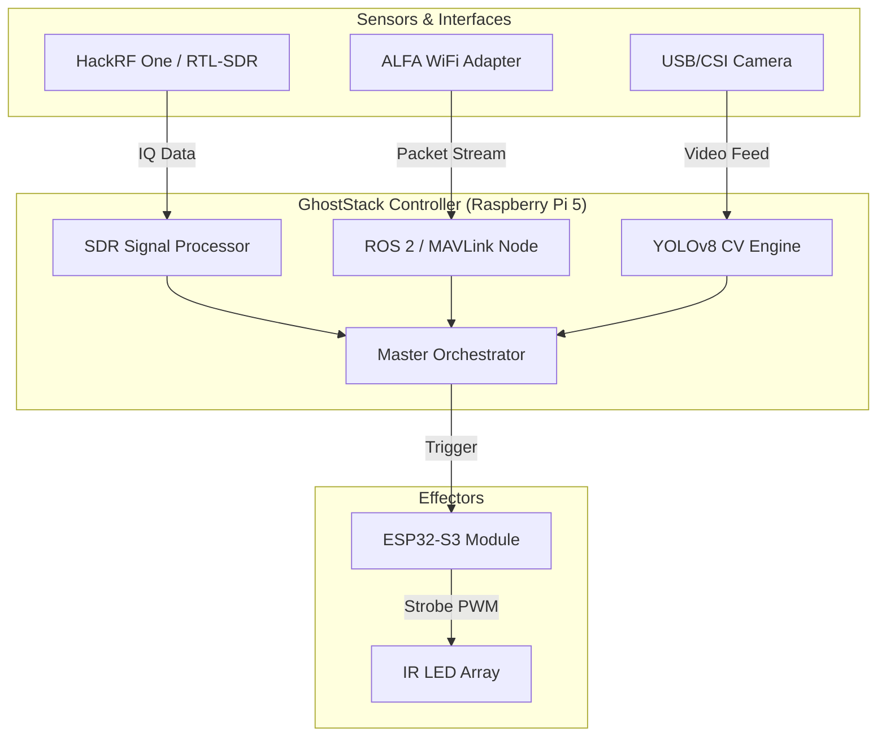

# GhostStack

## Asymmetric Defense Research Framework

**GhostStack** is a modular, open-source research ecosystem designed for defensive threat-modeling and red-teaming against autonomous systems (UAVs, UGVs, and quadruped robotics). Utilizing Frugal, Commercial Off-The-Shelf (COTS) hardware, GhostStack enables security researchers to explore non-kinetic disruption methods across RF, optical, and network layers.

---

## ⚠️ Disclaimer & Legal Notice

**FOR EDUCATIONAL AND RESEARCH PURPOSES ONLY.**

The use of Electronic Warfare (EW) techniques, RF jamming, or optical disruption is strictly regulated or prohibited by local, national, and international laws (e.g., FCC in the USA, OFCOM in the UK). 

1. **Compliance:** Users are responsible for ensuring all activities comply with local regulations.
2. **Authorized Testing Only:** GhostStack components should only be used in controlled environments or against systems you own/have explicit permission to test.
3. **Safety:** High-power IR and RF emissions can be hazardous. See `docs/HARDWARE_BUILD.md` for safety protocols.
4. **No Liability:** The developers of GhostStack assume no liability for misuse, legal consequences, or hardware damage resulting from the use of this software.

---

## Mission Statement

To democratize the study of autonomous system vulnerabilities. As robotics and autonomous platforms proliferate, understanding their failure modes—specifically under asymmetric conditions—is critical for modern security posture. GhostStack provides a pragmatic platform for evaluating the resilience of these systems against non-traditional interference.

---

## The Stack

### Hardware Requirements
- **Compute:** Raspberry Pi 5 (8GB) running Kali Linux ARM.
- **RF/EW Layer:** HackRF One (Transceiver) or RTL-SDR (Receiver).
- **Optical Layer:** ESP32-S3 Microcontroller + High-Power IR LED Arrays.
- **Network Layer:** ALFA AWUS036ACM (Packet injection/Monitor mode WiFi).

### Software Requirements
- **OS:** Kali Linux / Raspberry Pi OS (64-bit).
- **RF Tools:** GNU Radio 3.10+, GamutRF, SoapySDR.
- **Network:** Aircrack-ng, Scapy, Pymavlink.
- **Robotics:** ROS 2 Humble (for telemetry analysis).
- **CV/AI:** Ultralytics YOLOv8 (for adversarial research).

---

## System Architecture



---

## Data Flow & Threat Model

```mermaid
sequenceDiagram
    participant UAV as Autonomous System (UAV/UGV)
    participant GS as GhostStack SDR/WiFi
    participant CV as GhostStack Vision
    participant CTL as GhostStack Master CTL
    participant OPT as Optical Disruption Module

    UAV->>GS: Broadcasts Telemetry (MAVLink/RemoteID)
    GS->>CTL: Signal Detected / Location Extracted
    UAV->>CV: Enters Visual Range
    CV->>CTL: Object Classified (YOLOv8)
    CTL->>OPT: Trigger Countermeasure
    OPT->>UAV: Optical Desync (IR Strobing)
    Note right of UAV: Navigation/CV Failure
```

---

## Modular Architecture

### 📡 RF/EW (`rf_ew/`)
Focuses on signal classification and GNSS resilience. 
- **`classification/`**: Real-time signal identification using **GamutRF** and passive **Remote ID** sniffing.
- **`scanner_24ghz.py`**: Automated power level detection for FHSS control links.

### 🌐 Network Analysis (`network_analysis/`)
Targets the communication protocols of autonomous platforms.
- **`mavlink_exploits/`**: Vulnerability analysis of the MAVLink protocol, including command injection (Disarm PoC) and signature bypass research.
- **`alpr_research/`**: Security research into **Flock Safety** and ALPR systems, including passive detection via WiFi probe requests.

### 👁️ CV Adversarial (`cv_adversarial/`)
Explores the vulnerabilities of machine-vision systems.
- **`patches/`**: Research into adversarial patches for **YOLOv8**, designed to exploit object-detection loss and achieve "digital cloaking."
- **`yolo_detector.py`**: Baseline real-time detection for patch verification.

### 🔦 Optical Disruption (`optical_disruption/`)
Physical-layer interference for camera and LiDAR systems.
- **`esp32/optical_strobe/`**: Firmware for high-power randomized IR strobing to desync rolling-shutter sensors and introduce LiDAR noise.

---

## Getting Started

### 1. Environment Setup
Clone the repository and install the base dependencies on Kali Linux:
```bash
git clone https://github.com/your-repo/GhostStack.git
cd GhostStack
chmod +x scripts/install_deps.sh
./scripts/install_deps.sh
```

### 2. Hardware Assembly
Refer to `docs/HARDWARE_BUILD.md` for BOMs and schematics for the ESP32 Optical Blinder.

### 3. Execution
- **RF Monitoring:** `python3 rf_ew/classification/remote_id_sniffer.py`
- **Network Audit:** `python3 network_analysis/mavlink_exploits/disarm_poc.py`
- **CV Research:** `python3 cv_adversarial/patches/yolo_detector.py`

---

## Contribution & Citation

We welcome contributions from the security research community. Please submit PRs with detailed technical rationale.

**Cite this project:**
> *GhostStack: An Asymmetric Defense Research Framework for Autonomous Systems (2026).* Open-source security research repository.
