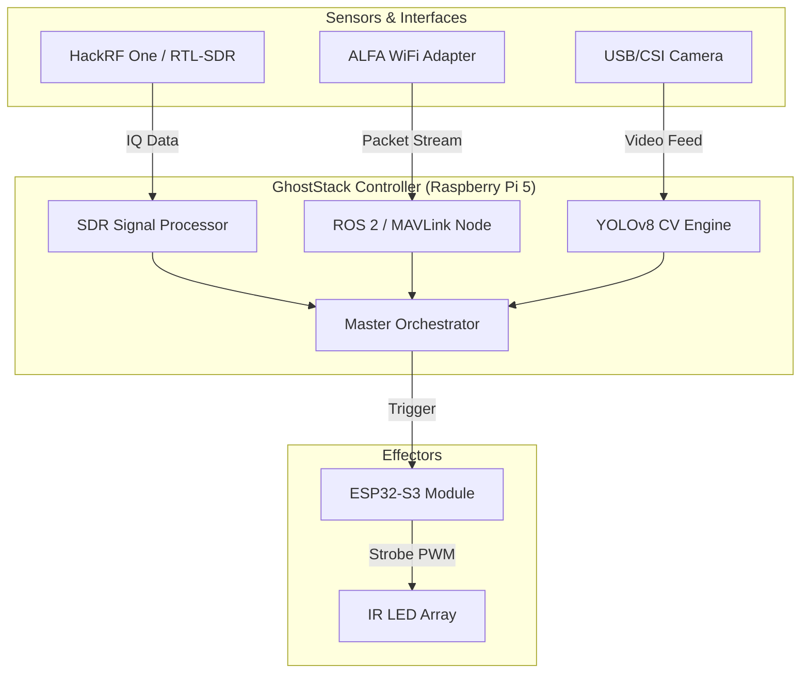

# GhostStack

## Asymmetric Defense Research Framework

**GhostStack** is a modular, open-source research ecosystem designed for defensive threat-modeling and red-teaming against autonomous systems (UAVs, UGVs, and quadruped robotics). Utilizing Frugal, Commercial Off-The-Shelf (COTS) hardware, GhostStack enables security researchers to explore non-kinetic disruption methods across RF, optical, and network layers.

---

## ⚠️ Disclaimer & Legal Notice

**FOR EDUCATIONAL AND RESEARCH PURPOSES ONLY.**

The use of Electronic Warfare (EW) techniques, RF jamming, or optical disruption is strictly regulated or prohibited by local, national, and international laws (e.g., FCC in the USA, OFCOM in the UK). 

1. **Compliance:** Users are responsible for ensuring all activities comply with local regulations.
2. **Authorized Testing Only:** GhostStack components should only be used in controlled environments or against systems you own/have explicit permission to test.
3. **Safety:** High-power IR and RF emissions can be hazardous. See `docs/HARDWARE_BUILD.md` for safety protocols.
4. **No Liability:** The developers of GhostStack assume no liability for misuse, legal consequences, or hardware damage resulting from the use of this software.

---

## Mission Statement

To democratize the study of autonomous system vulnerabilities. As robotics and autonomous platforms proliferate, understanding their failure modes—specifically under asymmetric conditions—is critical for modern security posture. GhostStack provides a pragmatic platform for evaluating the resilience of these systems against non-traditional interference.

---

## The Stack

### Hardware Requirements
- **Compute:** Raspberry Pi 5 (8GB) running Kali Linux ARM.
- **RF/EW Layer:** HackRF One (Transceiver) or RTL-SDR (Receiver).
- **Optical Layer:** ESP32-S3 Microcontroller + High-Power IR LED Arrays.
- **Network Layer:** ALFA AWUS036ACM (Packet injection/Monitor mode WiFi).

### Software Requirements
- **OS:** Kali Linux / Raspberry Pi OS (64-bit).
- **RF Tools:** GNU Radio 3.10+, GamutRF, SoapySDR.
- **Network:** Aircrack-ng, Scapy, Pymavlink.
- **Robotics:** ROS 2 Humble (for telemetry analysis).
- **CV/AI:** Ultralytics YOLOv8 (for adversarial research).

---

## System Architecture



---

## Data Flow & Threat Model

```mermaid
sequenceDiagram
    participant UAV as Autonomous System (UAV/UGV)
    participant GS as GhostStack SDR/WiFi
    participant CV as GhostStack Vision
    participant CTL as GhostStack Master CTL
    participant OPT as Optical Disruption Module

    UAV->>GS: Broadcasts Telemetry (MAVLink/RemoteID)
    GS->>CTL: Signal Detected / Location Extracted
    UAV->>CV: Enters Visual Range
    CV->>CTL: Object Classified (YOLOv8)
    CTL->>OPT: Trigger Countermeasure
    OPT->>UAV: Optical Desync (IR Strobing)
    Note right of UAV: Navigation/CV Failure
```

---

## Core Library (`ghoststack/`)

Shared Python package used by the orchestrator, dashboard, and field modules:

| Module | Responsibility |
|--------|----------------|
| `ghoststack/supervisor.py` | Process supervision, geo updates, policy dispatch |
| `ghoststack/policies.py` | YAML policy evaluation and target templating |
| `ghoststack/geo.py` | Safe-zone checks and coordinate parsing |
| `ghoststack/database.py` | SQLite events and health persistence |
| `ghoststack/modules.py` | RF / network / sentry module profiles |
| `ghoststack/mavlink.py` | GLOBAL_POSITION_INT / GPS_RAW_INT decode |
| `ghoststack/auth.py` | Dashboard HTTP + Socket.IO authentication |

See `docs/ENGINEERING.md` for the full runbook.

## Modular Architecture

### 📡 RF/EW (`rf_ew/`)
Focuses on signal classification and GNSS resilience. 
- **`classification/`**: Real-time signal identification using **GamutRF** and passive **Remote ID** sniffing.
- **`scanner_24ghz.py`**: Automated power level detection for FHSS control links.

### 🌐 Network Analysis (`network_analysis/`)
Targets the communication protocols of autonomous platforms.
- **`mavlink_exploits/`**: Vulnerability analysis of the MAVLink protocol, including command injection (Disarm PoC) and signature bypass research.
- **`alpr_research/`**: Security research into **Flock Safety** and ALPR systems, including passive detection via WiFi probe requests.

### 👁️ CV Adversarial (`cv_adversarial/`)
Explores the vulnerabilities of machine-vision systems.
- **`patches/`**: Research into adversarial patches for **YOLOv8**, designed to exploit object-detection loss and achieve "digital cloaking."
- **`yolo_detector.py`**: Baseline real-time detection for patch verification.

### 🔦 Optical Disruption (`optical_disruption/`)
Physical-layer interference for camera and LiDAR systems.
- **`esp32/optical_strobe/`**: Firmware for high-power randomized IR strobing to desync rolling-shutter sensors and introduce LiDAR noise.

---

## Getting Started

### 1. Docker Deployment (Recommended)
GhostStack includes a fully containerized environment, ensuring all RF, ROS 2, and AI dependencies are isolated.
```bash
git clone https://github.com/NicoMancinelli/GhostStack.git
cd GhostStack
docker-compose up --build
```
*Once running, navigate to `http://localhost:5000` to view the **Live Threat Dashboard**.*

### 2. Bare-Metal Environment Setup
If you prefer running directly on Kali Linux:
```bash
chmod +x scripts/install_deps.sh
./scripts/install_deps.sh
```

### 3. Hardware Assembly & Flashing
Refer to `docs/HARDWARE_BUILD.md` for BOMs and schematics for the ESP32 Optical Blinder.
You can automatically flash the firmware using the included script:
```bash
chmod +x scripts/flash_esp32.sh
./scripts/flash_esp32.sh /dev/ttyUSB0
```

### 4. Execution (Bare-Metal)
You can orchestrate the entire suite using the Master Controller, which automatically logs threats to a local SQLite database:
- `python3 scripts/ghoststack_ctl.py start-rf`
- `python3 scripts/ghoststack_ctl.py start-network`
- `python3 scripts/ghoststack_ctl.py start-all --sentry` (active sentry profile)
- `python3 scripts/ghoststack_ctl.py stop-all` (remote stop via pidfile)
- `python3 dashboard/app.py` (tactical UI — default login `ghost` / `stack`, change in `config/dashboard.yaml`)

### 5. Verify Installation
```bash
pytest -q
python3 scripts/smoke_test.py
```

---

## Example Use Cases

All scenarios assume **authorized lab environments** and compliant RF/optical regulations.

### Use Case 1: RF Drone Signature Lab (GamutRF + Policy Auto-Response)

**Goal:** Detect a known UAV control signature and log an automated optical countermeasure policy match.

1. Start Mosquitto (or use GamutRF container MQTT) and the RF profile:
   ```bash
   python3 scripts/ghoststack_ctl.py start-rf --esp-port /dev/ttyUSB0
   python3 dashboard/app.py
   ```
2. Publish a test inference message to `gamutrf/inference`:
   ```json
   {"predictions": {"dji_mavic": 0.95}, "center_freq": 2440000000}
   ```
3. **Expected:** Orchestrator logs `[!]` with `confidence: 0.95`; if ESP32 is connected and target is outside `config/safe_zones.yaml`, policy **Auto-Neutralize Known Drones** triggers the strobe.

**Tunable:** Lower threshold in sentry mode: `python3 scripts/ghoststack_ctl.py start-rf --sentry`

---

### Use Case 2: MAVLink GPS Tracking & Geo-Fence Inhibition

**Goal:** Plot live vehicle position on the dashboard and suppress effectors inside safe zones.

1. Run ArduPilot SITL or `network_analysis/ghoststack_network/spoofing_node.py` (ROS 2) to emit `GLOBAL_POSITION_INT` on UDP/14550.
2. Start network stack + dashboard:
   ```bash
   python3 scripts/ghoststack_ctl.py start-network
   python3 dashboard/app.py
   ```
3. Open `http://localhost:5000` (authenticate if prompted).
4. **Expected:** `mav-sniff` decodes real lat/lon from MAVLink (not map-center placeholders). Markers appear on the Leaflet map. Coordinates inside `config/safe_zones.yaml` set `is_in_safe_zone` and fire **Safe Zone Inhibition**.

---

### Use Case 3: Quadruped Backdoor Detection → MAVLink Failover

**Goal:** Detect a hidden robot AP and launch the kill-switch against a configurable subnet.

1. Edit `config/targets.yaml` (`mavlink_broadcast`) for your robot VLAN.
2. Monitor mode on WiFi (`wlan0mon`), then:
   ```bash
   python3 scripts/ghoststack_ctl.py start-network --sentry
   ```
3. **Expected:** `unitree-detect` logs `[!] ... BACKDOOR AP DETECTED`; policy **Backdoor Failover Hijack** spawns `mavlink_killswitch.py` with `{mavlink_broadcast}` substituted.

---

### Use Case 4: Red-Team Demo (Live Kill Chain)

**Goal:** End-to-end detect → visualize → disrupt for presentations (`docs/DEMO_SCRIPT.md`).

| Step | Action | Result |
|------|--------|--------|
| 1 | `python3 dashboard/app.py` + `ghoststack_ctl.py start-network --esp-port /dev/ttyUSB0` | Dashboard + orchestrator running |
| 2 | Run MAVLink/spoofing telemetry | Threat rows in SQLite + map markers |
| 3 | Observe ESP32 | Serial `b'1'` on policy match; auto `b'0'` after timeout |

---

### Use Case 5: Docker Field Stack

**Goal:** Containerized RF core + authenticated dashboard sharing one database volume.

```bash
export GHOSTSTACK_DASHBOARD_PASSWORD='your-secure-password'
docker-compose up --build
```

- Core: `http://host` (RF modules, host networking)
- Dashboard: `http://localhost:5000` (user/password from env)
- Shared DB: `./data/ghoststack.db`

---

### Use Case 6: CI / Headless Regression

**Goal:** Validate core library without hardware.

```bash
pytest -q
python3 scripts/smoke_test.py
docker compose -f docker-compose.smoke.yml run --rm ghoststack-smoke
```

---

## Contribution & Citation

We welcome contributions from the security research community. Please submit PRs with detailed technical rationale.

**Cite this project:**
> *GhostStack: An Asymmetric Defense Research Framework for Autonomous Systems (2026).* Open-source security research repository.
